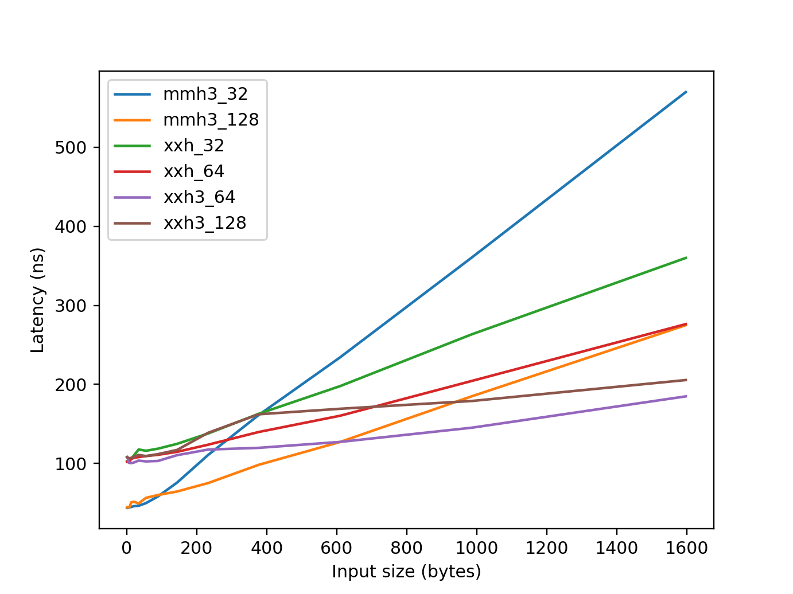
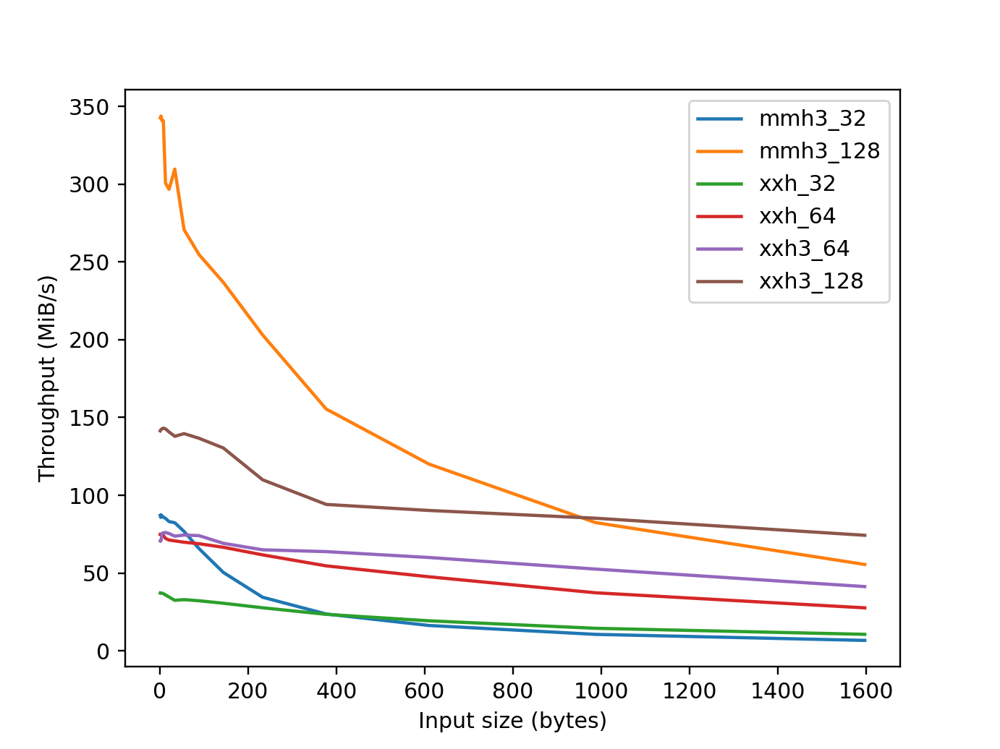

<!-- markdownlint-disable MD025 -->

# Summary

This decade has witnessed the rapid evolution of artificial intelligence (AI),
notably in the field of natural language processing (NLP), as represented by
the popularity of OpenAI’s ChatGPT. Another important advancement in computer
science and engineering is found in the field of the Internet of Things (IoT),
a crucial component of ubiquitous computing, as represented by the development
of Shodan, the world's first IoT search engine.

Underlying these advancements are high-performance algorithms and data
structures that use non-cryptographic hash functions. This type of hash
functions is generally characterized by four properties; they are fast, their
resulting bits are statistically well-distributed, they have an avalanche
effect, meaning a one-bit difference in a key changes at least half of the
resulting bits, and they are collision resistant. Because cryptographic
strength is not required in these use cases, they can leverage the efficiency
of non-cryptographic hash functions.

MurmurHash3 and its test suite, SMHasher, was developed
by @appleby_murmurhash3_2011 and is one of the earliest and most continuously
popular hash functions specifically designed to implement the characteristics
mentioned above.

`mmh3` was launched in 2011 as a Python wrapper for MurmurHash3 and has been
maintained ever since. Its API is very simple to use for Python programmers,
as it offers both simple one-shot hash functions and hasher classes that allow
incremental updating, whose methods are compliant to `hashlib`, a part of the
Python Standard Library. The library provides Python wheels (i.e., pre-built
binary packages) for immediate use on various platforms, including Linux
(x86_64, aarch64, i686, ppc64le, and s390x), Windows (win32, win_amd64,
and win_arm64), and macOS (Intel Mac and Apple Silicon). From version 4.0.0,
`mmh3` has been published under the MIT License, an OSI-approved permissive
open-source license.

As of September 1, 2024, `mmh3` was being downloaded more than 4 million times
per month, and it ranks as the 973th most downloaded PyPI package
(of around 566,000 projects), showing that only 0.17% of the remaining packages
in the PyPI ecosystem are more popular [@hugo_van_kemenade_2024_13624792].
According to PePy, as of September 1, 2024, the total downloads of
this library exceeded 130 millions.

Libraries and organizations that directly use `mmh3` include
Shodan (the world’s first IoT search engine),
Azure SDK for Python (the official open-source Azure libraries for Python by
Microsoft), Apache Iceberg (open table format for analytic datasets),
Feast (feature store for machine learning),
PyMilvus (Python SDK for Milvus, an open-source vector database),
and pocsuite3 (open-source remote vulnerability testing framework).

# Statement of need

## AI and High-Performance Computing

AI is one of the most resource-demanding fields in computer science
and engineering. To mitigate this problem, various techniques are employed
under main systems, in which non-cryptographic hash functions play key roles
in a number of algorithms and data structures.

A notable technique is _feature hashing_ [@Weinberger2009; @Shi2009]. In its
simplest usage, when given a string-indexed data vector, it simply converts the
vector into an integer-indexed data vector in which each index is the hash
result of the original string index; collision values are simply summed.
Despite its simple and intuitive usage, a machine-learning process with feature
hashing is statistically guaranteed to be nearly as accurate as its original
process. Feature hashing has been shown to be useful for various situations,
including K-means clustering [@Senuma2011]
and succinct model learning [@Senuma2016].

Other popular techniques that leverage non-cryptographic hash functions include
_Bloom Filter_ [@Bloom1970], a compact data structure that tests whether an
element is a member of a certain set (with false positive matches), and
_MinHash_ [@Broder1997a], an algorithm that quickly estimates the similarity of
two sets.

`mmh3` appears in scholarly papers on various topics,
including Indian language NLP suites [@kakwani_indicnlpsuite_2020],
a secure system based on probabilistic structures [@adja_blockchain-based_2021],
as well as secure ciphertext deduplication in cloud storage [@Tang2024].
It has also appeared in technical books and computer science texts
[@gorelick_high_2020; @kumar_probabilistic_2021; @medjedovic_algorithms_2022].

## Internet of Things

`mmh3` is applicable to the IoT field. According to @shodan_its_2021,
Shodan [@Matherly2017] uses `mmh3` as its fingerprint for a favicon (i.e., an
icon associated with a web page or website). @Matherly2024 explained
the adoption of `mmh3` due to its speed and compact hash size,
noting that cryptographic guarantees provided by `md5` and other hashes were
not necessary for their use case. ZoomEye, another popular IoT search engine,
follows Shodan’s convention.

As a result, `mmh3` is considered a useful tool for cybersecurity.
For example, @kopriva_hunting_2021 reported a method of discovering possible
phishing websites by searching websites with Shodan,
whose favicon’s `mmh3` hash value was the same as that of
a genuine and trustable one.

Another use case of `mmh3` in this area includes open-source intelligence
(OSINT) activities, such as measuring the global popularity of web frameworks
and servers, as some users do not change their default favicon settings
specified by applications. @faraday_security_understanding_2022 described
a method of using `mmh3` and Shodan to approximate the popularity of `Spring`,
a Java-based web framework.

# Related software

`PYMMH` [@kihlander_pymmh3_2013] is a pure Python implementation of the
MurmurHash3 algorithm. Among various other Python bindings for
non-cryptographic hashes, `python-xxhash` by Yue Du [@du_xxhash_2014] is another
popular hash library, featuring xxHash developed by
Yan Collet [@collet_xxhash_2014].

# Benchmarks

To compare the efficiency of Python-C hash function libraries, we carefully
conducted microbenchmarking experiments, aiming to balance between accuracy,
reproducibility, and reliability. Our methodology follows established
practices from microbenchmarking literature, including works by @Peters2002,
@Stinner2016, @gorelick_high_2020, @RodriguezGuerra2021, @Bernhardt2023,
and @collet_xxhash_comparison_2024.

\autoref{bandwidth} summarizes the results of our benchmarking experiments.

\autoref{latency} shows latency, while \autoref{throughput} presents
throughput, measured as the size of hash output generated per second.
Although the `xxh3` family in `python-xxhash` demonstrates superior performance
for large inputs, the `mmh3` implementation excels with smaller inputs.
This advantage is largely due to the latest version 5.0.0,
which leverages `METH_FASTCALL`, a new calling method
introduced in Python 3.7 that reduces the overhead of function calls.
As a result, our library is particularly well-suited for use cases involving
repeated hashing of small keys—one of the common scenarios for
non-cryptographic hash functions.

For further details, refer to the documentation of the project:
<https://mmh3.readthedocs.io/en/latest/benchmark.html>.
In addition, the benchmarking results are publicly available as JSON files in
the repository: <https://github.com/hajimes/mmh3-benchmarks>.

: \label{bandwidth}Benchmarking results for Python extensions.
Collet2020 refers to the results for original C implementations benchmarked
by the creator of xxHash.

| Hash Name   |   Width | Bandwidth   |   Width-Weighted Score | Collet2020   |
|:------------|--------:|:------------|-----------------------:|:-------------|
| xxh3_128    |     128 | 22.42 GiB/s |              2869.5    | 29.60 GiB/s  |
| xxh3_64     |      64 | 22.41 GiB/s |              1434.02   | 31.50 GiB/s  |
| xxh_64      |      64 | 8.90 GiB/s  |               569.619  | 9.10 GiB/s   |
| mmh3_128    |     128 | 6.91 GiB/s  |               884.884  | nan GiB/s    |
| xxh_32      |      32 | 6.15 GiB/s  |               196.9    | 9.70 GiB/s   |
| mmh3_32     |      32 | 2.86 GiB/s  |                91.6    | 3.90 GiB/s   |
| sha1        |     160 | 1.63 GiB/s  |               261.572  | 0.80 GiB/s   |
| md5         |     128 | 0.65 GiB/s  |                83.3789 | 0.60 GiB/s   |

(CPU: 2.4-3.3 GHz) (CPU: 3.6-4.9 GHz)

# Acknowledgements

The author extends sincere gratitude to Akiko Aizawa for her helpful comments
on this paper. Appreciation is also given to all those involved in the
development and maintenance of `mmh3`. Special thanks go to Micha Gorelick,
who made the first pull request to the project and later introduced the
library in her technical book [@gorelick_high_2020].

# References
